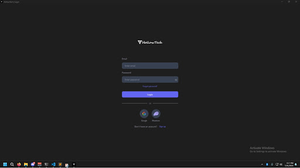

# Modern PySide6 Authentication Interface (Web2 + Web3 Ready)

A clean, professional authentication UI built using **PySide6**, designed to emulate modern web aesthetics inside a native Python desktop application.
Includes Login, Signup, Forgot Password, and Info/Policy views — all styled with custom theming, smooth interactions, and Web3-ready components.



> Add a screenshot named `preview.png` inside the `assets/` folder to display the UI above.

---

## ✨ Features

### 🌙 Modern UI/UX

* Custom QSS theming (no outdated default Qt look)
* Beautiful card-based authentication layout
* Smooth hover states and focus animations
* Clean typography and consistent spacing

### 🔐 Hybrid Authentication (Web2 + Web3)

* **Web2 Login:** Email + Password fields
* **Reset Password Flow** with confirmation messaging
* **Signup Screen** with optional invite code behavior
* **Web3-Ready Buttons:** Google + Phantom wallet placeholders ready to connect to OAuth or wallet APIs

### 🧩 Modular Architecture

* `LoginPage` emits `login_successful(username)` for easy app integration
* Components are self-contained, making the UI plug-and-play
* Backend-agnostic — integrate with:

  * Firebase / Supabase
  * Flask / FastAPI backend
  * Web3 providers like Solana RPC, Phantom Wallet Adapter, etc.

### 🛠️ Interactive Elements

* Password visibility toggle w/ hover-recolor SVG icons
* Inline error + success messaging
* Auto-clearing error states while typing
* Responsive design inside the authentication panel

---

## 🧱 Tech Stack

* **Language:** Python 3.10+
* **Framework:** PySide6 (Qt for Python)
* **UI Styling:** QSS with theme constants
* **Assets:** SVG + PNG icons (Google, Phantom, Eye / HiddenEye, Logos)

---

## ❓ Why This Exists

PySide6 is powerful — but its default widgets look outdated for modern apps.

This template solves that by offering a **web-inspired**, modern authentication interface you can drop directly into any desktop application (AI tools, crypto dashboards, automation suites, internal company software, etc.).

Perfect for:

* Portfolios
* Startup MVPs
* Web3 tools
* Desktop clients with modern design standards

---

## 📁 Project Structure

```
modern-pyside6-auth-ui/
│── assets/               # Logos, icons, and SVG UI assets
│── login_ui.py           # Full authentication UI (login/signup/reset/info)
│── main.py               # Application entry point
│── requirements.txt      # Python dependencies
│── README.md             # You're reading it :)
```

---

## 📦 Installation

### 1️⃣ Clone the Repository

```bash
git clone https://github.com/ATLMadeTH/modern-pyside6-auth-ui.git
cd modern-pyside6-auth-ui
```

### 2️⃣ Install Dependencies

```bash
pip install -r requirements.txt
```

### 3️⃣ Run the Application

```bash
python main.py
```

---

## 🔌 Connecting Your Backend

Inside `login_ui.py` you’ll find clearly marked **TODO** sections where backend integration goes:

### ✔ Login

Located in `handle_login()`
Replace the dummy check with real authentication logic. On success:

```python
self.login_successful.emit(username)
```

### ✔ Signup

Located in `handle_register()`
Connect this to your backend registration endpoint.

### ✔ Password Reset

Located in `handle_reset_password()`
Wire this to your email reset workflow or API.

Backend is intentionally excluded so you can use this in:

* commercial apps
* closed-source clients
* multi-tenant backends

---

## 📸 Screenshots

### Login View


---

## 🤝 Contributing

Pull requests are welcome!

If you'd like to contribute:

* new OAuth connectors (Google, GitHub, Discord, Phantom)
* theme packs (light mode, neon, material design)
* animations / transitions

…feel free to open an issue or PR.

---

## 📝 License

This project is released under the **MIT License** — free for personal and commercial use.

---

## ⭐ Support & Visibility

If this project helped you or saved development time, consider leaving a star on GitHub — it helps others discover the template and supports future improvements.
